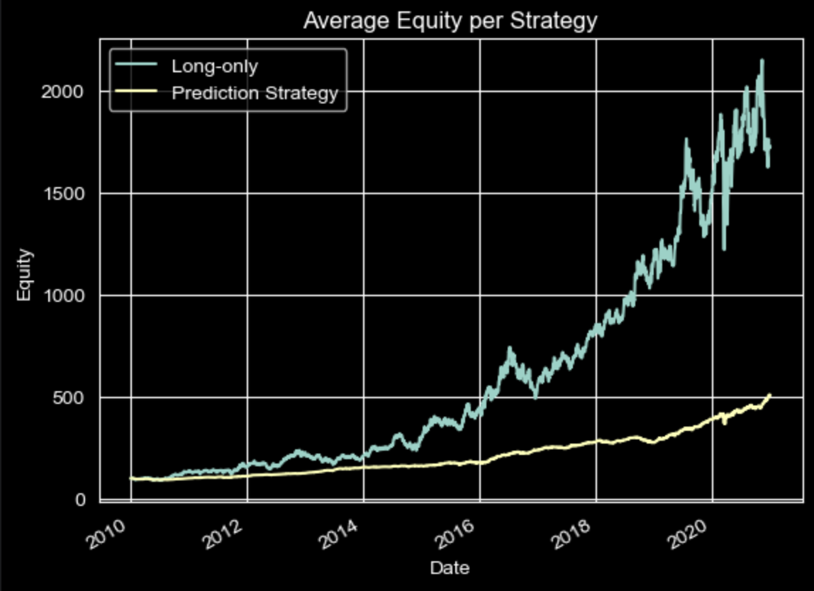
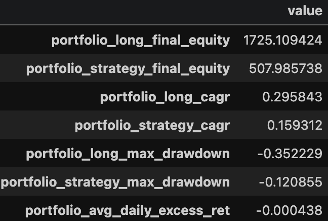

# ASX Market Pipeline

End-to-end workflow that downloads ASX50 OHLCV data, engineers features of this data, builds a duckdb prediction dataset, runs a simple Bayesian/backtest strategy, and compares it against a going-long baseline.


## Files
Key data files are written into `data/`:

| File | Description                                                          |
| --- |----------------------------------------------------------------------|
| `ohlcv_data.parquet` | Raw OHLCV data for current ASX50 companies                           |
| `feature_data.parquet` | Features of the OHLCV data per ticker/date (returns, vol, ATR, etc.) |
| `market.db` | duckdb database                                                      |
| `going_long_data.parquet` | Equal-weight going-long equity curve                                 |
| `bt_4555split.parquet` | Prediction strategy backtest results                                 |
| `bt_4555split_{per_ticker,portfolio,summary}.parquet` | Comparison outputs                                                   |

## Getting started

1. **Install Dependencies**
   ```bash
   pip install pandas numpy pyarrow duckdb yfinance seaborn matplotlib
   ```

2. **Run the pipeline**:
   ```bash
   python -m src.main
   ```
   Steps executed:
   - Fetch current ASX50 tickers.
   - Download/append OHLCV data from yfinance and build feature parquet.
   - Initialise duckdb views, compute adjusted opens and `prob_data`.
   - Compute Bayesian alpha, beta probabilities, run the backtest (0.45/0.55 thresholds), and save results.
   - Build the going-long baseline and comparison summary (per ticker + portfolio).

## Comparison outputs

`save_comparison("bt_4555split")` produces:
- `bt_4555split_per_ticker.parquet`: per-ticker summary (final equity, CAGR, drawdown, avg daily excess return).
- `bt_4555split_portfolio.parquet`: date-indexed mean equity/excess-return curve.
- `bt_4555split_summary.parquet`: aggregate metrics (portfolio-level final equity, CAGR, drawdown, mean excess return).

## Backtest Results (Bayesian Strategy vs Going Long)
The code for this comparison can be found in `notebooks/backtest_comparison.ipynb`

### Methodology
Results were crafted from the market data of companies who were public from 2010-01-01 to 2020-12-31.
Both methods had a starting equity of 100 for each company and equity was recorded and calculated every day
The entry/exit cost was calculated to be 0.00005 basis points
#### Going Long
The going long method involved buying at the open price in 2010-01-01 and selling in 2020-12-31
#### Bayesian Strategy
For every ticker we run a simple Bayesian probability update:
- Two independent Beta distributions track the likelihood that the next day opens above the prior close conditional on whether the current day closed up or down. 
- Each observation nudges the relevant alpha/beta counts, producing an updated probability `p_hat`. 
- Those probabilities feed into the backtest and if `p_hat` rises above 0.55 we go long, if it falls below 0.45 we short. 
- Equity is compounded daily per ticker, factoring in a transaction cost if any change in position was made.

### Visualising Results
#### Equity Comparison

#### Summary


#### Analysis
As can be seen from the graphs the bayesian strategy performed significantly worse than the going long strategy when talking strict equity returns. The bayesian strategy produced a CAGR of 0.159 whereas the long strategy produced a CAGR of 0.296. However, there are times, often during market crashes, where the bayesian strategy outperforms the long strategy. This is due to the significantly less volatility with the bayesian strategy, something to be aware of.